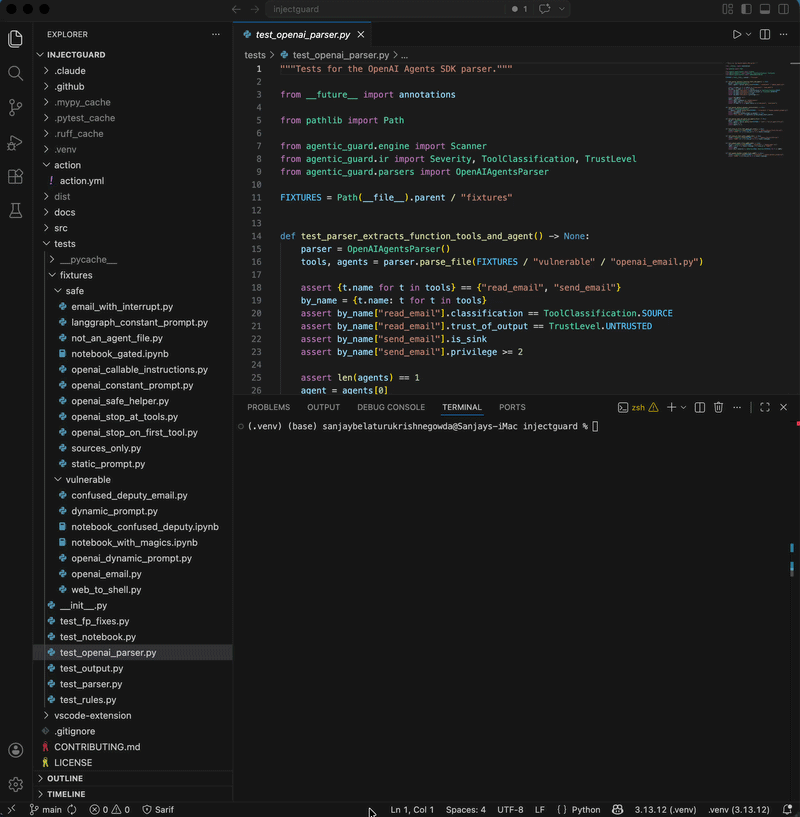

# agentic-guard

> Static analyzer for prompt-injection and confused-deputy risks in LLM agent code.
> The missing `bandit`/`semgrep` for AI agents.

[](https://github.com/sanjaybk7/agentic-guard/actions/workflows/ci.yml)
[](https://pypi.org/project/agentic-guard/)
[](LICENSE)
[](https://pypi.org/project/agentic-guard/)



`agentic-guard` reads your agent code (LangGraph, OpenAI Agents SDK, plus Jupyter notebooks)
and flags dangerous architectural patterns **before you ship** — without running the
agent, without sending data anywhere, without LLM calls.

```bash
pip install agentic-guard
agentic-guard scan ./my-agent-project
```

---

## Why this exists

The most common real-world AI security failure is the **confused deputy**: an agent
has a tool that reads untrusted text (an email, a web page, a PDF, a ticket) AND a
tool that takes a privileged action (sending email, transferring money, executing
shell commands), with the LLM acting as the unwitting middleman that follows attacker
instructions embedded in the untrusted text.

This pattern has shipped, in production, at major companies — Bing Chat, Slack AI,
Microsoft 365 Copilot, ChatGPT plugins have all had variants disclosed publicly.
Existing AI-security tools work at *runtime* — they inspect prompts as they happen
and try to block injection attempts. They can't tell you whether your agent's
**architecture** is unsafe.

`agentic-guard` catches the architectural mistakes at build time, when they're cheap
to fix.

---

## What it catches

| ID | Name | OWASP LLM Top 10 |
|----|------|------------------|
| `IG001` | Confused-deputy: untrusted source flows to a privileged sink without a human-approval gate | LLM01 + LLM06 |
| `IG002` | System prompt built from runtime input (f-string / `.format()` / concat) | LLM01 |

Severity is scored on the sink's privilege × reversibility × source trust. The
classification of which tools are sources vs sinks lives in
[`src/agentic_guard/taxonomy.yaml`](src/agentic_guard/taxonomy.yaml) and is community-extensible.

---

## Quick start

```bash
pip install agentic-guard

# Scan a directory or a single file
agentic-guard scan ./my-agent-project

# Different output formats
agentic-guard scan ./agent --format pretty    # default — human-readable terminal output
agentic-guard scan ./agent --format sarif     # GitHub code scanning / IDE integration
agentic-guard scan ./agent --format json      # machine-readable

# Useful flags
agentic-guard scan ./agent --fail-on high     # exit non-zero on HIGH+ findings (CI gate)
agentic-guard scan ./agent --include-tests    # also scan test files (skipped by default)
agentic-guard scan ./agent --output report.sarif
```

### GitHub Action

Add to `.github/workflows/ci.yml`:

```yaml
- uses: sanjaybk7/agentic-guard@v0.1.0
  with:
    path: .
    fail-on: high
```

Findings appear in your repo's **Security → Code scanning** tab via SARIF upload.

### VS Code extension

Inline diagnostics on save (red squigglies in the editor, hover tooltips with rule
ID + OWASP mapping + fix hint). See [vscode-extension/README.md](vscode-extension/README.md)
for build/install instructions.

---

## Supported frameworks

| Framework | Status | Recognized patterns |
|---|---|---|
| **LangGraph** | ✅ supported | `@tool` decorators, `create_react_agent(...)` and similar factories, `interrupt_before=[...]` gates |
| **OpenAI Agents SDK** | ✅ supported | `@function_tool` decorators, `Agent(...)` constructor, `tool_use_behavior="stop_on_first_tool"` and `StopAtTools(...)` gates |
| **Jupyter notebooks (.ipynb)** | ✅ supported | Code cells extracted and parsed; magics/shell escapes sanitized; findings report `cell[N] line M` |
| Microsoft Agent Framework | ⏳ planned | — |
| MCP servers | ⏳ planned | — |
| AutoGen, CrewAI, Swarm | ⏳ unsupported | Open an issue if you'd use this |

---

## How it works

1. **Discovery.** Walks your project, picks up `.py` and `.ipynb` files. Skips `tests/`,
   `venv/`, `__pycache__/`, etc. by default.
2. **Parse.** For each file, builds a Python AST. For notebooks, extracts code cells
   into virtual source first.
3. **Per-framework recognition.** A parser fires only when the file imports its
   framework (so a generic `class Agent:` won't false-positive). Each parser
   produces a framework-agnostic intermediate representation: `Tool` and `Agent`
   objects with classifications, privilege levels, and gating info.
4. **Taint-aware rule evaluation.** Detection rules operate on the IR, not on
   framework-specific syntax. Adding a new framework means writing a new parser
   only — the rules stay the same.
5. **Output.** Pretty terminal panels, SARIF v2.1.0 (with `security-severity`
   for GitHub Security tab badges), or JSON.

**No code is executed. No data leaves your machine. No LLM calls.**

A longer technical writeup, including the taint-analysis adaptation and
honest limitations, is in [`docs/HOW_IT_WORKS.md`](docs/HOW_IT_WORKS.md).

**Security researchers and OWASP contributors:** the formal threat
model — what we defend against, what we explicitly do not, our
attacker capability assumptions, and our coverage gaps — is in
[`docs/THREAT_MODEL.md`](docs/THREAT_MODEL.md). Read that before
filing a "missed attack class" issue.

---

## What `agentic-guard` is *not*

Being honest about scope matters more than overselling. This tool:

- **Is not a runtime defense.** It doesn't intercept prompts in production. Use
  Lakera, Prompt Armor, or NeMo Guardrails for that.
- **Is not a deep code analyzer.** It analyzes tool *names* and *agent architecture*,
  not what's inside tool function bodies. A function named `process()` whose body
  calls `smtplib.send()` is currently invisible to the tool — names matter, just
  as they do for `bandit`, ESLint, and Semgrep. (See roadmap for IG003.)
- **Does not support TypeScript-based agent frameworks** at v0. Python-only.
- **Does not execute, evaluate, or send your code anywhere.** All analysis is
  local and deterministic.

---

## Real-world validation

Scanned 9 popular open-source agent codebases (LangChain, LangGraph, OpenAI Agents
SDK, OpenAI Cookbook, GenAI_Agents, etc.) covering ~3,000 Python files and notebook
cells. Surfaced 22 prompt-injection patterns, all in `examples/` and `tutorial/`
code that developers actively copy from. Findings were not publicly disclosed against
specific repos; this is intended to be reported responsibly to maintainers as we
go.

---

## Roadmap

Driven by community feedback after v0 launch.

- **IG003 — library-call rule.** Walk inside tool function bodies for known-dangerous
  calls (`smtplib.send_message`, `subprocess.run`, `requests.post`, `boto3.client('ses')`,
  etc.) so tools with neutral names but dangerous bodies get caught.
- **Microsoft Agent Framework** parser (Python).
- **MCP server** parser.
- **`agentic-guard init`** — interactive command to add project-local taxonomy entries
  for unfamiliar tool names.

### Shipped in v0.2

- **Cross-module import resolution** for constants used as prompts. `from
  prompts import SYSTEM_PROMPT` (and relative, aliased, star, and
  attribute-access variants) no longer fires IG002 when the imported name
  resolves to a literal in a sibling module. See
  [`docs/HOW_IT_WORKS.md`](docs/HOW_IT_WORKS.md#cross-module-resolution).

---

## Contributing

Contributions very welcome — especially:

- **New taxonomy entries.** Edit `src/agentic_guard/taxonomy.yaml` to add tool-name
  patterns we don't recognize yet.
- **New rules.** Subclass `Rule` in `src/agentic_guard/rules/`.
- **New parsers.** Add a `FrameworkParser` for a framework we don't support.

See [CONTRIBUTING.md](CONTRIBUTING.md).

---

## Security disclosure

If you find a vulnerability in `agentic-guard` itself (rather than using
`agentic-guard` to find vulnerabilities), please email the maintainer rather than
opening a public issue.

If you find a vulnerability in a third-party project using `agentic-guard`, please
disclose it responsibly to that project's maintainers — give them at least 30
days to fix before public discussion.

---

## License

Apache-2.0. See [LICENSE](LICENSE).
